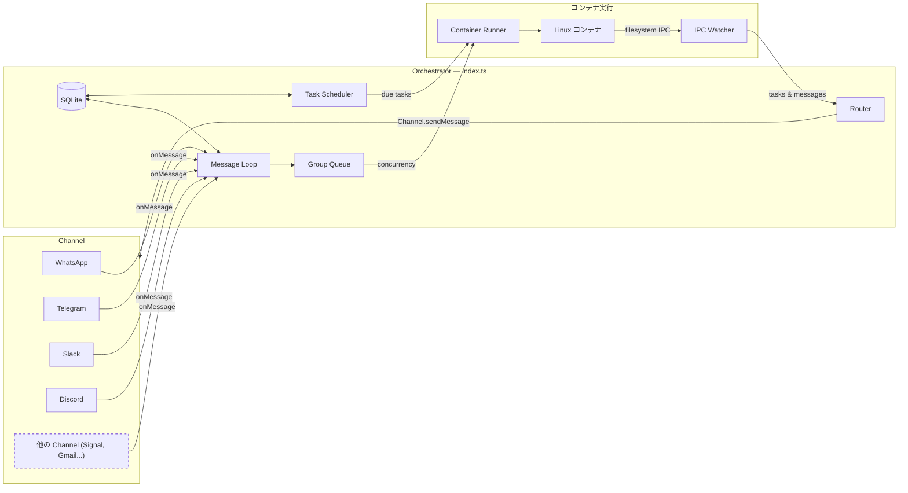

# NanoClaw 仕様書

> **biblio-claw fork note**: 本 doc は NanoClaw v2 上流 (commit `2492259`) の日本語訳の仕様書。**biblio-claw 独自機能 (仕入れ → 検品 → カテゴライズ → 陳列 / 装備機構 / channel = Slack + Fugue trunk 直コミット / gate 4 層 / Vertex×Claude keyless 認証等) は本 doc に含まれない**、下記の biblio-claw 固有 doc を参照:
>
> - **アーキテクチャ全体**: [`architecture.md`](architecture.md)
> - **セキュリティモデル**: [`SECURITY.md`](SECURITY.md)
> - **入力ゲート 4 層 (M4-F Phase 2)**: [`gate-4-layer.md`](gate-4-layer.md)
> - **Vertex×Claude keyless 認証 (WIF + Sidecar rotator)**: [`vertex-claude-keyless.md`](vertex-claude-keyless.md)
> - **装備機構 (M3)**: [`equip-physical.md`](equip-physical.md)
> - **運用早見表**: [`operations-runbook.md`](operations-runbook.md)
> - **biblio 独自語彙 (biblio / 司書 / patron 等)**: [`glossary.md`](glossary.md)

マルチチャネルサポート、会話ごとの永続メモリ、スケジュール済タスク、コンテナ分離された agent 実行を備えたパーソナル Claude アシスタント。

---

## 目次

1. [アーキテクチャ](#アーキテクチャ)
2. [アーキテクチャ:Channel システム](#アーキテクチャchannel-システム)
3. [フォルダ構造](#フォルダ構造)
4. [設定](#設定)
5. [メモリシステム](#メモリシステム)
6. [セッション管理](#セッション管理)
7. [メッセージフロー](#メッセージフロー)
8. [コマンド](#コマンド)
9. [スケジュール済タスク](#スケジュール済タスク)
10. [MCP Server](#mcp-server)
11. [デプロイ](#デプロイ)
12. [セキュリティ考慮事項](#セキュリティ考慮事項)

---

## アーキテクチャ

```
┌──────────────────────────────────────────────────────────────────────┐
│                        HOST (macOS / Linux)                           │
│                     (Main Node.js プロセス)                           │
├──────────────────────────────────────────────────────────────────────┤
│                                                                       │
│  ┌──────────────────┐                  ┌────────────────────┐        │
│  │ Channel          │─────────────────▶│   SQLite データベース │        │
│  │ (起動時に         │◀────────────────│   (messages.db)    │        │
│  │  self-register)   │  store/send      └─────────┬──────────┘        │
│  └──────────────────┘                            │                   │
│                                                   │                   │
│         ┌─────────────────────────────────────────┘                   │
│         │                                                             │
│         ▼                                                             │
│  ┌──────────────────┐    ┌──────────────────┐    ┌───────────────┐   │
│  │  Message Loop    │    │  Scheduler Loop  │    │  IPC Watcher  │   │
│  │  (SQLite を poll)│    │  (タスク確認)    │    │  (ファイル base)│   │
│  └────────┬─────────┘    └────────┬─────────┘    └───────────────┘   │
│           │                       │                                   │
│           └───────────┬───────────┘                                   │
│                       │ コンテナを spawn                              │
│                       ▼                                               │
├──────────────────────────────────────────────────────────────────────┤
│                     CONTAINER (Linux VM)                               │
├──────────────────────────────────────────────────────────────────────┤
│  ┌──────────────────────────────────────────────────────────────┐    │
│  │                    AGENT RUNNER                               │    │
│  │                                                                │    │
│  │  ワーキングディレクトリ: /workspace/group (host からマウント)    │    │
│  │  ボリュームマウント:                                             │    │
│  │    • groups/{name}/ → /workspace/group                         │    │
│  │    • groups/global/ → /workspace/global/ (non-main のみ)        │    │
│  │    • data/sessions/{group}/.claude/ → /home/node/.claude/      │    │
│  │    • 追加ディレクトリ → /workspace/extra/*                       │    │
│  │                                                                │    │
│  │  ツール (全 group):                                             │    │
│  │    • Bash (安全 — コンテナでサンドボックス化!)                   │    │
│  │    • Read, Write, Edit, Glob, Grep (ファイル操作)               │    │
│  │    • WebSearch, WebFetch (インターネットアクセス)               │    │
│  │    • agent-browser (ブラウザ自動化)                            │    │
│  │    • mcp__nanoclaw__* (IPC 経由 scheduler ツール)              │    │
│  │                                                                │    │
│  └──────────────────────────────────────────────────────────────┘    │
│                                                                       │
└───────────────────────────────────────────────────────────────────────┘
```

### 技術スタック

| コンポーネント | 技術 | 役割 |
|-----------|------------|---------|
| Channel システム | Channel registry(`src/channels/registry.ts`) | Channel が起動時に self-register |
| メッセージストレージ | SQLite(better-sqlite3) | polling 用にメッセージを保存 |
| コンテナランタイム | コンテナ(Linux VM) | agent 実行用の分離環境 |
| Agent | @anthropic-ai/claude-agent-sdk(0.2.29) | ツールと MCP server 付きで Claude を実行 |
| ブラウザ自動化 | agent-browser + Chromium | Web 操作とスクリーンショット |
| ランタイム | Node.js 20+ | ルーティングとスケジューリング用 host プロセス |

---

## アーキテクチャ:Channel システム

コアは channel を内蔵せず出荷される — 各 channel(WhatsApp、Telegram、Slack、Discord、Gmail)は [Claude Code skill](https://code.claude.com/docs/en/skills) として fork に channel コードを追加する形でインストールされる。Channel は起動時に self-register する;クレデンシャル不足の installed channel は WARN ログを emit してスキップされる。

### システム図



### Channel レジストリ

Channel システムは `src/channels/registry.ts` のファクトリレジストリ上に構築される:

```typescript
export type ChannelFactory = (opts: ChannelOpts) => Channel | null;

const registry = new Map<string, ChannelFactory>();

export function registerChannel(name: string, factory: ChannelFactory): void {
  registry.set(name, factory);
}

export function getChannelFactory(name: string): ChannelFactory | undefined {
  return registry.get(name);
}

export function getRegisteredChannelNames(): string[] {
  return [...registry.keys()];
}
```

各ファクトリは `ChannelOpts`(`onMessage`、`onChatMetadata`、`registeredGroups` 用コールバック)を受け取り、`Channel` インスタンスを返すか、その channel のクレデンシャルが設定されていなければ `null` を返す。

### Channel インターフェース

すべての channel が次のインターフェースを実装する(`src/types.ts` に定義):

```typescript
interface Channel {
  name: string;
  connect(): Promise<void>;
  sendMessage(jid: string, text: string): Promise<void>;
  isConnected(): boolean;
  ownsJid(jid: string): boolean;
  disconnect(): Promise<void>;
  setTyping?(jid: string, isTyping: boolean): Promise<void>;
  syncGroups?(force: boolean): Promise<void>;
}
```

### Self-Registration パターン

Channel は barrel-import パターンで self-register する:

1. 各 channel skill が `src/channels/` にファイルを追加(例:`whatsapp.ts`、`telegram.ts`)し、モジュール load 時に `registerChannel()` を呼ぶ:

   ```typescript
   // src/channels/whatsapp.ts
   import { registerChannel, ChannelOpts } from './registry.js';

   export class WhatsAppChannel implements Channel { /* ... */ }

   registerChannel('whatsapp', (opts: ChannelOpts) => {
     // クレデンシャルが無ければ null を返す
     if (!existsSync(authPath)) return null;
     return new WhatsAppChannel(opts);
   });
   ```

2. barrel ファイル `src/channels/index.ts` がすべての channel モジュールを import して登録をトリガーする:

   ```typescript
   import './whatsapp.js';
   import './telegram.js';
   // ... 各 skill がここに import を追加
   ```

3. 起動時、orchestrator(`src/index.ts`)は登録された channel をループし、有効なインスタンスを返すものに接続する:

   ```typescript
   for (const name of getRegisteredChannelNames()) {
     const factory = getChannelFactory(name);
     const channel = factory?.(channelOpts);
     if (channel) {
       await channel.connect();
       channels.push(channel);
     }
   }
   ```

### 主要ファイル

| ファイル | 役割 |
|------|---------|
| `src/channels/registry.ts` | Channel ファクトリレジストリ |
| `src/channels/index.ts` | Channel の self-registration をトリガーする barrel import |
| `src/types.ts` | `Channel` インターフェース、`ChannelOpts`、メッセージ型 |
| `src/index.ts` | Orchestrator — channel をインスタンス化し、message loop を実行 |
| `src/router.ts` | JID の所有 channel を見つけ、メッセージをフォーマット |

### 新しい Channel の追加

新しい channel を追加するには、次を行う skill を `.claude/skills/add-<name>/` に貢献する:

1. `Channel` インターフェースを実装する `src/channels/<name>.ts` ファイルを追加
2. モジュール load 時に `registerChannel(name, factory)` を呼ぶ
3. クレデンシャルが無ければファクトリから `null` を返す
4. `src/channels/index.ts` に import 行を追加

既存 skill(`/add-whatsapp`、`/add-telegram`、`/add-slack`、`/add-discord`、`/add-gmail`)でパターンを参照。

---

## フォルダ構造

```
nanoclaw/
├── CLAUDE.md                      # Claude Code 用プロジェクトコンテキスト
├── docs/
│   ├── SPEC.md                    # 本仕様書
│   ├── REQUIREMENTS.md            # アーキテクチャ判断
│   └── SECURITY.md                # セキュリティモデル
├── README.md                      # ユーザドキュメント
├── package.json                   # Node.js 依存
├── tsconfig.json                  # TypeScript 設定
├── .mcp.json                      # MCP server 設定(参考)
├── .gitignore
│
├── src/
│   ├── index.ts                   # Orchestrator: 状態、message loop、agent 呼び出し
│   ├── channels/
│   │   ├── registry.ts            # Channel ファクトリレジストリ
│   │   └── index.ts               # Channel self-registration 用 barrel import
│   ├── ipc.ts                     # IPC watcher とタスク処理
│   ├── router.ts                  # メッセージフォーマットと outbound ルーティング
│   ├── config.ts                  # 設定定数
│   ├── types.ts                   # TypeScript インターフェース(Channel を含む)
│   ├── logger.ts                  # Pino logger セットアップ
│   ├── db.ts                      # SQLite データベース初期化とクエリ
│   ├── group-queue.ts             # グローバル並行制限付きの group ごとキュー
│   ├── mount-security.ts          # コンテナ用マウント allowlist 検証
│   ├── whatsapp-auth.ts           # スタンドアロン WhatsApp 認証
│   ├── task-scheduler.ts          # due 時にスケジュール済タスクを実行
│   └── container-runner.ts        # コンテナで agent を spawn
│
├── container/
│   ├── Dockerfile                 # コンテナイメージ('node' ユーザで実行、Claude Code CLI 含む)
│   ├── build.sh                   # コンテナイメージのビルドスクリプト
│   ├── agent-runner/              # コンテナ内で実行されるコード
│   │   ├── package.json
│   │   ├── tsconfig.json
│   │   └── src/
│   │       ├── index.ts           # エントリポイント (query loop, IPC ポーリング, セッション再開)
│   │       └── ipc-mcp-stdio.ts   # host 通信用 stdio-based MCP server
│   └── skills/
│       └── agent-browser.md       # ブラウザ自動化 skill
│
├── dist/                          # コンパイル済 JavaScript (gitignore)
│
├── .claude/
│   └── skills/
│       ├── setup/SKILL.md              # /setup - 初回インストール
│       ├── customize/SKILL.md          # /customize - 機能追加
│       ├── debug/SKILL.md              # /debug - コンテナデバッグ
│       ├── add-telegram/SKILL.md       # /add-telegram - Telegram channel
│       ├── add-gmail/SKILL.md          # /add-gmail - Gmail 統合
│       ├── add-voice-transcription/    # /add-voice-transcription - Whisper
│       ├── x-integration/SKILL.md      # /x-integration - X/Twitter
│       ├── convert-to-apple-container/  # /convert-to-apple-container - Apple Container ランタイム
│       └── add-parallel/SKILL.md       # /add-parallel - 並列 agent
│
├── groups/
│   ├── CLAUDE.md                  # グローバルメモリ (全 group が読む)
│   ├── {channel}_main/             # メイン制御 channel (例:whatsapp_main/)
│   │   ├── CLAUDE.md              # メイン channel メモリ
│   │   └── logs/                  # タスク実行ログ
│   └── {channel}_{group-name}/    # group ごとフォルダ (登録時に作成)
│       ├── CLAUDE.md              # group 固有メモリ
│       ├── logs/                  # この group のタスクログ
│       └── *.md                   # agent が作ったファイル
│
├── store/                         # ローカルデータ (gitignore)
│   ├── auth/                      # WhatsApp 認証状態
│   └── messages.db                # SQLite データベース (messages, chats, scheduled_tasks, task_run_logs, registered_groups, sessions, router_state)
│
├── data/                          # アプリケーション状態 (gitignore)
│   ├── sessions/                  # group ごとセッションデータ (JSONL transcript 付き .claude/ ディレクトリ)
│   ├── env/env                    # コンテナマウント用 .env のコピー
│   └── ipc/                       # コンテナ IPC (messages/, tasks/)
│
├── logs/                          # ランタイムログ (gitignore)
│   ├── nanoclaw.log               # Host stdout
│   └── nanoclaw.error.log         # Host stderr
│   # Note: コンテナごとのログは groups/{folder}/logs/container-*.log
│
└── launchd/
    └── com.nanoclaw.plist         # macOS サービス設定
```

---

## 設定

設定定数は `src/config.ts` にある:

```typescript
import path from 'path';

export const ASSISTANT_NAME = process.env.ASSISTANT_NAME || 'Andy';

// パスは絶対 (コンテナマウントに必須)
const PROJECT_ROOT = process.cwd();
export const STORE_DIR = path.resolve(PROJECT_ROOT, 'store');
export const GROUPS_DIR = path.resolve(PROJECT_ROOT, 'groups');
export const DATA_DIR = process.env.DATA_DIR || path.resolve(PROJECT_ROOT, 'data'); // env で差し替え可 (DSN アダプタが解決)

// コンテナ設定
export const CONTAINER_IMAGE = process.env.CONTAINER_IMAGE || 'nanoclaw-agent:latest';
export const CONTAINER_TIMEOUT = parseInt(process.env.CONTAINER_TIMEOUT || '1800000', 10); // 30 分デフォルト
export const IDLE_TIMEOUT = parseInt(process.env.IDLE_TIMEOUT || '1800000', 10); // 30 分 — 最後の結果後コンテナを生かす
export const MAX_CONCURRENT_CONTAINERS = Math.max(1, parseInt(process.env.MAX_CONCURRENT_CONTAINERS || '5', 10) || 5);

export const TRIGGER_PATTERN = new RegExp(`^@${ASSISTANT_NAME}\\b`, 'i');
```

**Note:** コンテナのボリュームマウントが正しく動くには、パスが絶対である必要がある。

### コンテナ設定

Group は SQLite の `registered_groups` テーブル内の `containerConfig`(`container_config` カラムに JSON として保存)経由で追加ディレクトリをマウントできる。登録例:

```typescript
setRegisteredGroup("1234567890@g.us", {
  name: "Dev Team",
  folder: "whatsapp_dev-team",
  trigger: "@Andy",
  added_at: new Date().toISOString(),
  containerConfig: {
    additionalMounts: [
      {
        hostPath: "~/projects/webapp",
        containerPath: "webapp",
        readonly: false,
      },
    ],
    timeout: 600000,
  },
});
```

フォルダ名は `{channel}_{group-name}` 規約に従う(例:`whatsapp_family-chat`、`telegram_dev-team`)。メイン group は登録時に `isMain: true` を設定する。

追加マウントはコンテナ内で `/workspace/extra/{containerPath}` に現れる。

**マウント構文の注意:** Read-write マウントは `-v host:container` を使うが、readonly マウントは `--mount "type=bind,source=...,target=...,readonly"` が必要(`:ro` サフィックスは一部のランタイムで動かないかも)。

### Claude 認証

プロジェクトルートの `.env` ファイルで認証を設定する。2 つのオプション:

**Option 1: Claude サブスクリプション (OAuth トークン)**
```bash
CLAUDE_CODE_OAUTH_TOKEN=sk-ant-oat01-...
```
Claude Code にログインしていれば、トークンは `~/.claude/.credentials.json` から抽出できる。

**Option 2: Pay-per-use API キー**
```bash
ANTHROPIC_API_KEY=sk-ant-api03-...
```

認証変数(`CLAUDE_CODE_OAUTH_TOKEN` と `ANTHROPIC_API_KEY`)のみ `.env` から抽出して `data/env/env` に書き、その後コンテナ内 `/workspace/env-dir/env` にマウントされ、entrypoint スクリプトが source する。これにより `.env` 内の他の環境変数が agent に露出しないようにする。この workaround が必要なのは、一部のコンテナランタイムが `-i`(stdin パイプ付き対話モード)で `-e` 環境変数を失うため。

### アシスタント名の変更

`ASSISTANT_NAME` 環境変数を設定する:

```bash
ASSISTANT_NAME=Bot pnpm start
```

または `src/config.ts` のデフォルトを編集する。これは次を変える:
- トリガーパターン(メッセージは `@YourName` で始まる必要)
- 応答プレフィックス(`YourName:` が自動追加される)

### launchd 内のプレースホルダ値

`{{PLACEHOLDER}}` 値を持つファイルは設定が必要:
- `{{PROJECT_ROOT}}` - nanoclaw インストールへの絶対パス
- `{{NODE_PATH}}` - node バイナリへのパス(`which node` 経由で検出)
- `{{HOME}}` - ユーザのホームディレクトリ

---

## メモリシステム

NanoClaw は CLAUDE.md ファイルベースの階層メモリシステムを使う。

### メモリ階層

| レベル | 場所 | 読み手 | 書き手 | 役割 |
|-------|----------|---------|------------|---------|
| **Global** | `groups/CLAUDE.md` | 全 group | Main のみ | 全会話で共有される設定、事実、コンテキスト |
| **Group** | `groups/{name}/CLAUDE.md` | その group | その group | group 固有のコンテキスト、会話メモリ |
| **Files** | `groups/{name}/*.md` | その group | その group | 会話中に作成されたメモ、リサーチ、ドキュメント |

### メモリの動作

1. **Agent コンテキストロード**
   - Agent は `cwd` を `groups/{group-name}/` に設定して実行
   - `settingSources: ['project']` を持つ Claude Agent SDK が自動的にロード:
     - `../CLAUDE.md`(親ディレクトリ = グローバルメモリ)
     - `./CLAUDE.md`(現在ディレクトリ = group メモリ)

2. **メモリへの書き込み**
   - ユーザが「これを覚えて」と言うと、agent は `./CLAUDE.md` に書く
   - ユーザが「これをグローバルに覚えて」と言うと(メイン channel のみ)、agent は `../CLAUDE.md` に書く
   - Agent は group フォルダに `notes.md`、`research.md` のようなファイルを作れる

3. **メイン channel の特権**
   - 「メイン」group(self-chat)のみがグローバルメモリに書ける
   - メインは登録済 group を管理し、任意の group にタスクをスケジュールできる
   - メインは任意の group の追加ディレクトリマウントを設定できる
   - すべての group が Bash アクセスを持つ(コンテナ内で動くので安全)

---

## セッション管理

セッションは会話の継続性を可能にする — Claude があなたが何を話したか覚える。

### セッションの動作

1. 各 group は SQLite(`sessions` テーブル、`group_folder` をキーとする)にセッション ID を保存する
2. セッション ID が Claude Agent SDK の `resume` オプションに渡される
3. Claude がフルコンテキストで会話を継続する
4. セッショントランスクリプトは `data/sessions/{group}/.claude/` に JSONL ファイルとして保存される

---

## メッセージフロー

### 受信メッセージフロー

```
1. ユーザが接続済の任意の channel 経由でメッセージを送る
   │
   ▼
2. Channel がメッセージを受信 (例:WhatsApp は Baileys、Telegram は Bot API)
   │
   ▼
3. メッセージが SQLite に保存される (store/messages.db)
   │
   ▼
4. Message loop が SQLite を poll (2 秒ごと)
   │
   ▼
5. Router がチェック:
   ├── chat_jid が登録済 group (SQLite) にあるか? → No: 無視
   └── メッセージがトリガーパターンにマッチするか? → No: 保存するが処理しない
   │
   ▼
6. Router が会話に追いつく:
   ├── 前回 agent 対話以降の全メッセージを fetch
   ├── タイムスタンプと送信者名でフォーマット
   └── フル会話コンテキスト付きでプロンプトを構築
   │
   ▼
7. Router が Claude Agent SDK を呼ぶ:
   ├── cwd: groups/{group-name}/
   ├── prompt: 会話履歴 + 現在のメッセージ
   ├── resume: session_id (継続用)
   └── mcpServers: nanoclaw (scheduler)
   │
   ▼
8. Claude がメッセージを処理:
   ├── コンテキスト用に CLAUDE.md ファイルを読む
   └── 必要に応じてツールを使う (検索、メール 等)
   │
   ▼
9. Router がアシスタント名でレスポンスにプレフィックスを付け、所有 channel 経由で送信
   │
   ▼
10. Router が最後の agent タイムスタンプを更新し、セッション ID を保存
```

### トリガーワードマッチング

メッセージはトリガーパターン(デフォルト:`@Andy`)で始まる必要がある:
- `@Andy what's the weather?` → ✅ Claude をトリガー
- `@andy help me` → ✅ トリガー(大小文字区別なし)
- `Hey @Andy` → ❌ 無視(トリガーが先頭にない)
- `What's up?` → ❌ 無視(トリガーなし)

### 会話のキャッチアップ

トリガーされたメッセージが届いたとき、agent はその chat 内で最後の対話以降の全メッセージを受け取る。各メッセージはタイムスタンプと送信者名でフォーマットされる:

```
[Jan 31 2:32 PM] John: hey everyone, should we do pizza tonight?
[Jan 31 2:33 PM] Sarah: sounds good to me
[Jan 31 2:35 PM] John: @Andy what toppings do you recommend?
```

これにより、agent が言及されていないメッセージがあっても会話コンテキストを理解できる。

---

## コマンド

### 任意の group で利用可能なコマンド

| コマンド | 例 | 効果 |
|---------|---------|--------|
| `@Assistant [message]` | `@Andy what's the weather?` | Claude と話す |

### メイン channel でのみ利用可能なコマンド

| コマンド | 例 | 効果 |
|---------|---------|--------|
| `@Assistant add group "Name"` | `@Andy add group "Family Chat"` | 新しい group を登録 |
| `@Assistant remove group "Name"` | `@Andy remove group "Work Team"` | group の登録を解除 |
| `@Assistant list groups` | `@Andy list groups` | 登録済 group を表示 |
| `@Assistant remember [fact]` | `@Andy remember I prefer dark mode` | グローバルメモリに追加 |

---

## スケジュール済タスク

NanoClaw には組み込みの scheduler があり、タスクを group のコンテキストで完全な agent として実行する。

### スケジューリングの動作

1. **Group コンテキスト**: group で作成されたタスクは、その group のワーキングディレクトリとメモリで実行される
2. **完全な agent 機能**: スケジュール済タスクはすべてのツール(WebSearch、ファイル操作 等)にアクセスできる
3. **オプションのメッセージング**: タスクは `send_message` ツールを使って group にメッセージを送るか、silent に完了できる
4. **メイン channel の特権**: メイン channel は任意の group にタスクをスケジュールし、全タスクを表示できる

### スケジュールタイプ

| タイプ | 値のフォーマット | 例 |
|------|--------------|---------|
| `cron` | Cron 表現 | `0 9 * * 1`(月曜 9 時) |
| `interval` | ミリ秒 | `3600000`(1 時間ごと) |
| `once` | ISO タイムスタンプ | `2024-12-25T09:00:00Z` |

### タスクの作成

```
User: @Andy remind me every Monday at 9am to review the weekly metrics

Claude: [mcp__nanoclaw__schedule_task を呼ぶ]
        {
          "prompt": "Send a reminder to review weekly metrics. Be encouraging!",
          "schedule_type": "cron",
          "schedule_value": "0 9 * * 1"
        }

Claude: 完了! 毎週月曜 9 時にリマインドします。
```

### 1 回限りタスク

```
User: @Andy at 5pm today, send me a summary of today's emails

Claude: [mcp__nanoclaw__schedule_task を呼ぶ]
        {
          "prompt": "Search for today's emails, summarize the important ones, and send the summary to the group.",
          "schedule_type": "once",
          "schedule_value": "2024-01-31T17:00:00Z"
        }
```

### タスクの管理

任意の group から:
- `@Andy list my scheduled tasks` - この group のタスクを表示
- `@Andy pause task [id]` - タスクを一時停止
- `@Andy resume task [id]` - 一時停止タスクを再開
- `@Andy cancel task [id]` - タスクを削除

メイン channel から:
- `@Andy list all tasks` - 全 group のタスクを表示
- `@Andy schedule task for "Family Chat": [prompt]` - 別 group にスケジュール

---

## MCP Server

### NanoClaw MCP(組み込み)

`nanoclaw` MCP server は agent 呼び出しごとに現在の group のコンテキストで動的に作成される。

**利用可能なツール:**
| ツール | 役割 |
|------|---------|
| `schedule_task` | 再帰または 1 回限りのタスクをスケジュール |
| `list_tasks` | タスクを表示(group のタスク、または main なら全部) |
| `get_task` | タスクの詳細と実行履歴を取得 |
| `update_task` | タスクプロンプトまたはスケジュールを変更 |
| `pause_task` | タスクを一時停止 |
| `resume_task` | 一時停止タスクを再開 |
| `cancel_task` | タスクを削除 |
| `send_message` | group の channel 経由で group にメッセージを送る |

---

## デプロイ

NanoClaw は単一の macOS launchd サービスとして動く。

### 起動シーケンス

NanoClaw が起動すると次を行う:
1. **コンテナランタイムが動いているか確認** - 必要なら自動起動;前回の実行から残った孤立 NanoClaw コンテナを kill
2. SQLite データベースを初期化(JSON ファイルがあれば移行)
3. SQLite から状態をロード(登録済 group、セッション、router 状態)
4. **Channel に接続** — 登録済 channel をループ、クレデンシャル付きをインスタンス化、各々で `connect()` を呼ぶ
5. 少なくとも 1 つの channel が接続したら:
   - Scheduler ループを開始
   - コンテナメッセージ用 IPC watcher を開始
   - `processGroupMessages` で group ごとのキューをセットアップ
   - シャットダウン前の未処理メッセージを回復
   - メッセージポーリングループを開始

### サービス: com.nanoclaw

**launchd/com.nanoclaw.plist:**
```xml
<?xml version="1.0" encoding="UTF-8"?>
<!DOCTYPE plist PUBLIC "-//Apple//DTD PLIST 1.0//EN" "...">
<plist version="1.0">
<dict>
    <key>Label</key>
    <string>com.nanoclaw</string>
    <key>ProgramArguments</key>
    <array>
        <string>{{NODE_PATH}}</string>
        <string>{{PROJECT_ROOT}}/dist/index.js</string>
    </array>
    <key>WorkingDirectory</key>
    <string>{{PROJECT_ROOT}}</string>
    <key>RunAtLoad</key>
    <true/>
    <key>KeepAlive</key>
    <true/>
    <key>EnvironmentVariables</key>
    <dict>
        <key>PATH</key>
        <string>{{HOME}}/.local/bin:/usr/local/bin:/usr/bin:/bin</string>
        <key>HOME</key>
        <string>{{HOME}}</string>
        <key>ASSISTANT_NAME</key>
        <string>Andy</string>
    </dict>
    <key>StandardOutPath</key>
    <string>{{PROJECT_ROOT}}/logs/nanoclaw.log</string>
    <key>StandardErrorPath</key>
    <string>{{PROJECT_ROOT}}/logs/nanoclaw.error.log</string>
</dict>
</plist>
```

### サービスの管理

```bash
# サービスをインストール
cp launchd/com.nanoclaw.plist ~/Library/LaunchAgents/

# サービスを起動
launchctl load ~/Library/LaunchAgents/com.nanoclaw.plist

# サービスを停止
launchctl unload ~/Library/LaunchAgents/com.nanoclaw.plist

# 状態を確認
launchctl list | grep nanoclaw

# ログを見る
tail -f logs/nanoclaw.log
```

---

## セキュリティ考慮事項

### コンテナ分離

すべての agent はコンテナ(軽量 Linux VM)の中で動き、次を提供する:
- **ファイルシステム分離:** Agent はマウントされたディレクトリにのみアクセスできる
- **安全な Bash アクセス:** コマンドは Mac ではなくコンテナの中で動く
- **ネットワーク分離:** 必要ならコンテナごとに設定可能
- **プロセス分離:** コンテナのプロセスは host に影響を与えられない
- **非 root ユーザ:** コンテナは非特権 `node` ユーザ(uid 1000)で動く

### プロンプト injection リスク

WhatsApp メッセージは Claude の振る舞いを操作しようとする悪意ある命令を含みうる。

**緩和策:**
- コンテナ分離が爆発半径を制限する
- 登録済 group のみが処理される
- トリガーワードが必要(偶発的処理を減らす)
- Agent は自身の group のマウント済ディレクトリのみアクセスできる
- メインは group ごとに追加ディレクトリを設定できる
- Claude の組み込み safety training

**推奨:**
- 信頼できる group のみ登録する
- 追加ディレクトリマウントを慎重にレビューする
- スケジュール済タスクを定期的にレビューする
- ログで異常な活動をモニタする

### クレデンシャル保存

| クレデンシャル | 保存場所 | 注意 |
|------------|------------------|-------|
| Claude CLI 認証 | data/sessions/{group}/.claude/ | group ごとの分離、/home/node/.claude/ にマウント |
| WhatsApp セッション | store/auth/ | 自動作成、約 20 日持続 |

### ファイル権限

groups/ フォルダは個人メモリを含み、保護されるべき:
```bash
chmod 700 groups/
```

---

## トラブルシューティング

### 一般的な問題

| 問題 | 原因 | 解決法 |
|-------|-------|----------|
| メッセージに応答しない | サービスが動いていない | `launchctl list | grep nanoclaw` を確認 |
| "Claude Code process exited with code 1" | コンテナランタイム起動失敗 | ログを確認、NanoClaw はコンテナランタイムを自動起動するが失敗する場合あり |
| "Claude Code process exited with code 1" | セッションマウントパス間違い | マウントが `/root/.claude/` ではなく `/home/node/.claude/` であることを確認 |
| セッションが継続しない | セッション ID が保存されていない | SQLite を確認:`sqlite3 store/messages.db "SELECT * FROM sessions"` |
| セッションが継続しない | マウントパスの不一致 | コンテナユーザは `node`、HOME=/home/node;セッションは `/home/node/.claude/` にある必要 |
| "QR code expired" | WhatsApp セッション期限切れ | store/auth/ を削除して再起動 |
| "No groups registered" | group を追加していない | メインで `@Andy add group "Name"` を使う |

### ログの場所

- `logs/nanoclaw.log` - stdout
- `logs/nanoclaw.error.log` - stderr

### デバッグモード

詳細出力のため手動実行:
```bash
pnpm run dev
# or
node dist/index.js
```
