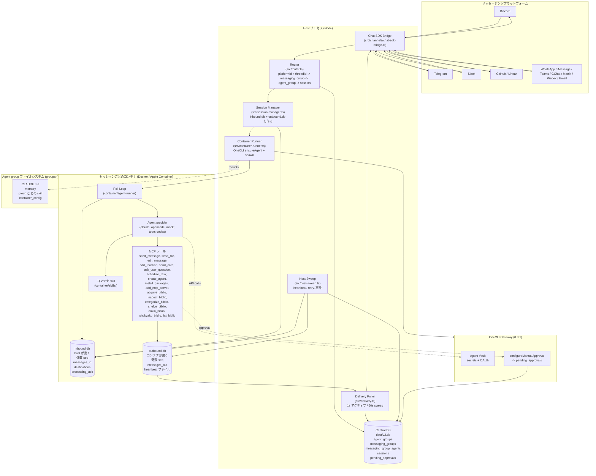
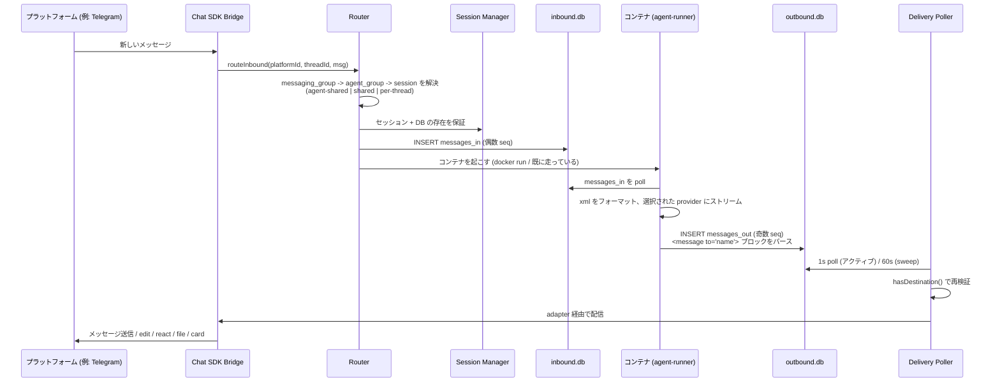
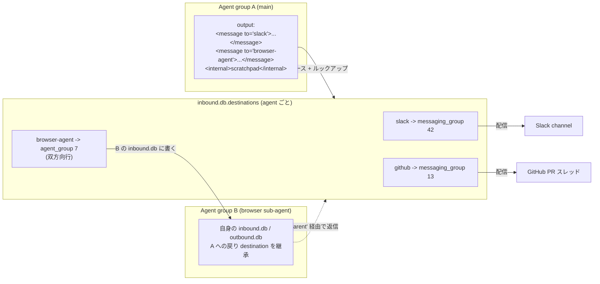
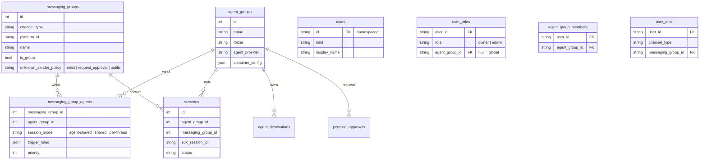
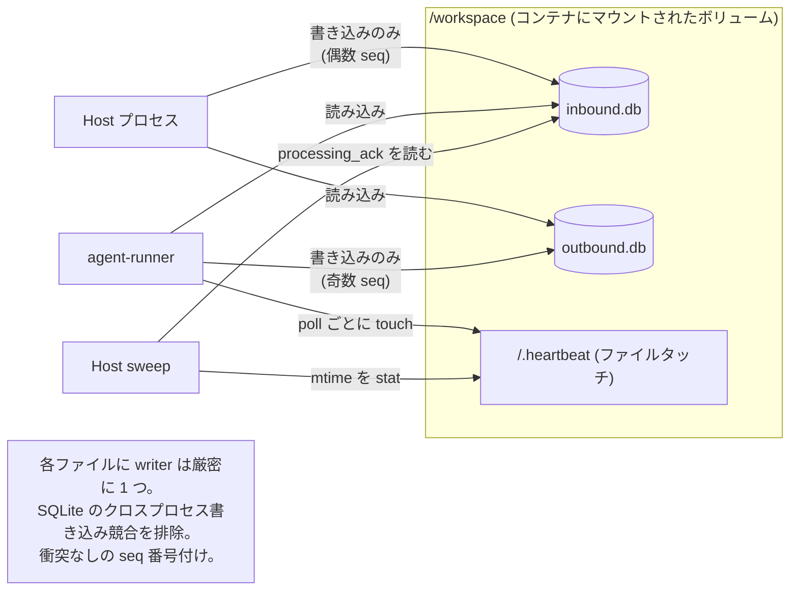

# NanoClaw アーキテクチャ図

## システム概要

## メッセージフロー (inbound -> agent -> outbound)

## Named destination と agent-to-agent

## エンティティモデル + 分離レベル

### 分離レベル早見表

| レベル | `session_mode` | 何が共有されるか | 例 |
|---|---|---|---|
| 1. 共有セッション | `agent-shared` | Workspace + memory + 会話 | Slack + GitHub webhook を 1 スレッドで |
| 2. 同じ agent、別セッション | `shared` / `per-thread` | Workspace + memory のみ | 1 agent を 3 つの Telegram chat 越しに |
| 3. 別 agent group | (異なる `agent_group_id`) | 何も共有しない | 個人 channel vs 仕事 channel |

## Two-DB 分割 (理由)

